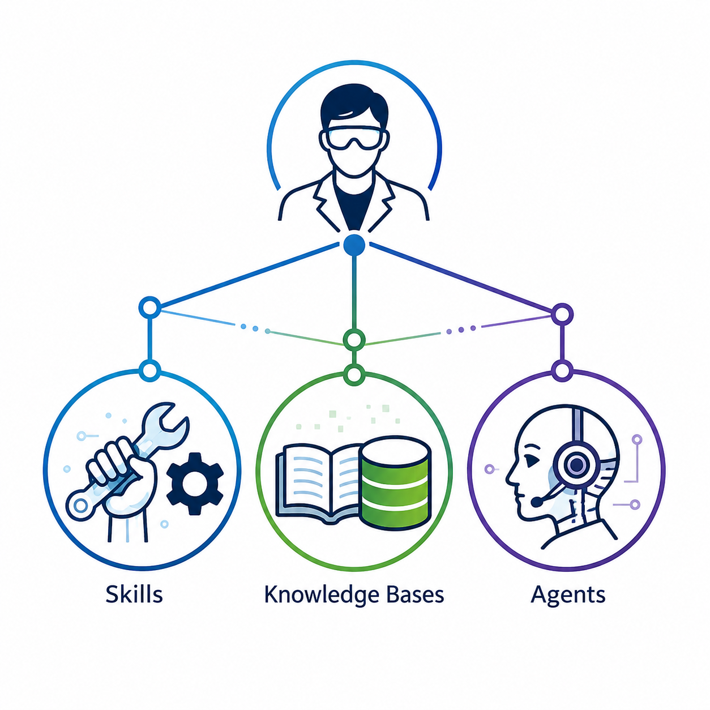

<p align="center">
  
</p>

<h1 align="center">Science Lab AI Framework</h1>

<p align="center">
  <em>A framework for leveraging large language models as reliable science tools.</em><br>
  <strong>Forked, not consumed.</strong><br>
  <span style="color:#6a6a66;">Repo: <code>science-lab-AI-framework</code></span>
</p>

<p align="center">
  <a href="LICENSE-DOCS"></a>
  <a href="LICENSE-CODE"></a>
  
  
  <!-- <a href="https://doi.org/PLACEHOLDER"></a> -->
</p>

---

## What this is

A **vendor-neutral framework** for setting up the persistent infrastructure a working scientist needs to leverage large language models as science tools across projects, sessions, and model generations.

The framework is built around three architectural fundamentals:

1. **Skills** as externalised conventions, methodological defaults, and workflows that the model invokes the same way every time.
2. **Sub-agents** as specialist roles that mirror how a real lab divides cognitive labour.
3. **Knowledge bases** as curated, topic-organised, citation-anchored reference layers that grow with the researcher's career.

It is intentionally generic. Out of the box it does nothing lab-specific. The point is that you fork it, run the AI-assisted onboarding, and end up with a framework tuned to your lab, your voice, your methods, and your tools.

## Why this exists

LLMs are useful tools for supporting science, but they require essential scaffolding to produce reliable workflows and products. This framework is an operational layer containing the key elements scientists can use to build tailored workflows specific to their needs, making LLMs more useful and reliable. It is not a static, standardised tool; it is a structural framework for continuously evolving and improving workflows specific to your scientific uses and preferences.

It is not a packaged AI system. It is not vendor-specific. It is not a substitute for scientific judgment.

It is a starting point.

## Architecture at a glance

The scientist configures the framework; the framework structures the LLM's work; the LLM's outputs flow back through the framework for the scientist to review and iterate. Every interface is two-way.

```
        ┌──────────────────────────────────────────────────┐
        │              Working scientist                   │
        │       holds authority, curates, iterates         │
        └──────────┬───────────────────────────▲───────────┘
                   │                           │
              configures /                  reviews /
              maintains                     iterates
                   ▼                           │
        ┌──────────────────────────────────────────────────┐
        │  Skills  ◀──▶  Sub-agents  ◀──▶  Knowledge base  │
        │              (the framework files)               │
        └──────────┬───────────────────────────▲───────────┘
                   │                           │
              invokes /                     outputs /
              structures                    drafts
                   ▼                           │
        ┌──────────────────────────────────────────────────┐
        │     Any capable LLM (Claude / GPT / Gemini)      │
        └──────────────────────────────────────────────────┘
```

The cycle runs at every scale: a single chat session (LLM proposes; scientist verifies; framework updates), a project (skills get refined as analyses surface gaps), and a career (the knowledge base compounds across projects). The framework's job is to make every loop more reliable than the last.

## Setup

The framework is designed to be set up with AI assistance, which is the most reliable and efficient route. Direct editing of the files is also supported, and the two approaches combine freely: many adopters use the AI-assisted onboarding for the bulk of the work and then hand-edit anywhere they want to be more specific.

### Recommended: AI-assisted onboarding (~1 hour)

```bash
# 1. Fork or clone the framework into your own version control
git clone https://github.com/<your-username>/science-lab-AI-framework.git my-lab-framework
cd my-lab-framework

# 2. Open the onboarding form in your browser
open setup/lab-onboarding.html
# (or your distribution's equivalent: xdg-open / start)

# 3. Fill out the form. Your answers persist locally via localStorage.
#    Click "Export to text" when you finish.

# 4. Paste the exported text into a chat session with any capable LLM,
#    along with the prompt printed at the bottom of the export.
#    The LLM uses setup/SKILL.md to populate your templates.

# 5. Review the generated files, edit anything that does not match your lab,
#    commit, and you are ready.
```

What you end up with: populated `conventions/voice.md`, `manuscript-format.md`, `code-format.md`, `figure-format.md`, `reply-format.md`, stubs for any domain-specialist agents you need, and a seeded knowledge base with your first three topics. If you prefer chat over a browser form, `setup/SKILL.md` runs the same interview directly in any LLM session.

### Direct editing (anytime)

Every file in the framework is designed to be edited. Use the AI-assisted onboarding to scaffold most of your setup, then customise wherever you want more specificity:

- Copy any `*.template.md` to its non-template name and fill in the slots by hand.
- Audit any `SKILL.md` and adjust domain-specific examples or steps.
- Seed `knowledge_base/` with topic folders following the `_topic.template/` skeleton.

The component READMEs inside each top-level folder walk you through what each file does and how to populate it. Track your changes through the dashboard (next section).

## Tracking the framework as it grows

The dashboard at `tools/system-dashboard.html` is the central place to keep track of your framework as it develops. As you populate conventions, add domain-specialist agents, seed knowledge-base topics, or modify skills, the dashboard reflects what is in place and what is still pending. **Keep it open as you build.** It is the most reliable view of how your fork is evolving, both for yourself and for collaborators who clone from your version.

Regenerate it at any point:

```bash
node tools/generate-state.js
open tools/system-dashboard.html
```

The generator scans every component (skills, agents, conventions, knowledge_base, setup, tools) and produces both `tools/system-state.json` and an updated dashboard with the JSON embedded inline. The dashboard works opened directly via `file://`; no local HTTP server required.

Six panels cover:

- **Overview**: total counts of skills, agents, knowledge-base topics, and an adopter checklist of what is set up.
- **Skills**: every SKILL.md with its frontmatter description, path, and last-modified date.
- **Agents**: the core roster plus any domain specialists you have added.
- **Knowledge base**: topic folders with article counts; template folders flagged separately from real topics.
- **Conventions**: each file flagged as suggested (ships populated), populated (you filled in a template), or template only (still empty).
- **Setup**: onboarding prompts plus a recap of which conventions are populated.

The dashboard is intentionally dependency-free static HTML. No server, no build pipeline, no external CDN. Run the generator, open the file, see the state.

## What is inside

```
science-lab-AI-framework/
├── README.md                this file
├── CLAUDE.md                instructions for any AI instance loading the framework
├── LICENSE-DOCS             CC BY 4.0 for documentation
├── LICENSE-CODE             MIT for tooling code
│
├── skills/                  invokable SKILL.md files
│   ├── simple/              one-job skills (analysis-planning, manuscript-writing, code-review, ...)
│   └── workflows/           multi-phase orchestrators (manuscript-pipeline, research-iterate, ...)
│
├── agents/                  specialist sub-agent role files
│   ├── lab-director.md      task routing and cross-domain integration
│   ├── quantitative-scientist.md   statistical modelling, ML, diagnostics
│   ├── science-writer.md    literature research and manuscript drafting
│   ├── literature-extractor.md   verbatim quantitative extraction with provenance
│   ├── extraction-validator.md   source-faithfulness verification
│   └── _domain-specialist.template.md   skeleton for your own domain agents
│
├── knowledge_base/          topic-organised wiki for your lab's accumulated thinking
│   ├── SKILL.md             ingest / compile / query / maintain procedure
│   ├── GLOBAL-CONCEPTS.template.md
│   └── _topic.template/     skeleton showing the per-topic file format
│
├── conventions/             rules and protocols that skills load by reference
│   ├── research.md                          source-faithfulness contract (opinionated)
│   ├── iteration-workflow.md                six-phase loop (opinionated)
│   ├── research-quality-gates.md            analytic / visual / literature / framing gates (opinionated)
│   ├── visual-review-protocol.md            render-and-read for figures (opinionated)
│   ├── readiness-assessment.md              expertise coverage check (opinionated)
│   ├── system-improvement-protocol.md       self-update mechanism (opinionated)
│   ├── voice.template.md                    writing voice scaffold (template)
│   ├── manuscript-format.template.md        IMRAD + section conventions (template)
│   ├── reply-format.template.md             reviewer reply conventions (template)
│   ├── figure-format.template.md            plotting library + style (template)
│   ├── code-format.template.md              project structure + naming (template)
│   └── goal-spec.template.md                per-project endpoint definition (template)
│
├── setup/                   AI-assisted onboarding
│   ├── SKILL.md             orchestrator: interview to populated files
│   ├── lab-onboarding.html  self-contained HTML form
│   └── prompts/             helper prompts the setup skill uses
│
└── tools/                   runnable code
    ├── generate-state.js    dashboard data generator (Node.js)
    ├── system-dashboard.html  self-contained dashboard viewer
    └── README.md            how to run the dashboard
```

## What the setup interview asks

The HTML form covers seven phases. Answers persist in `localStorage` so partial fills survive a tab close; the chat-driven `setup/SKILL.md` walks through the same questions if you prefer.

- **Lab identity**: name, domain, primary methods and outputs.
- **Voice**: paste 2-3 sample paragraphs, set preferences for hedging, banned words, punctuation quirks.
- **Manuscript norms**: target journals, citation style, format conventions.
- **Code stack**: language, project structure, plotting library, version control.
- **Agent roster**: which domain specialists you need beyond the five core agents.
- **Knowledge-base seed**: three topics to populate first.
- **Quality preferences**: which research-iterate gates apply.

## Suggested fundamentals (and what you own)

The framework is yours to shape. Every file is editable, and the structure is built to accommodate replacement, removal, and extension. What ships in v0.2 is a starting point organised into two kinds of file:

- **Suggested fundamentals** (ship populated). A small set of baseline content that reflects current best practices for using LLMs reliably in research, especially around minimising hallucinations and maintaining source faithfulness. Includes: `conventions/research.md` (source-faithfulness contract), `conventions/iteration-workflow.md`, `conventions/research-quality-gates.md`, `conventions/visual-review-protocol.md`, `conventions/readiness-assessment.md`, `conventions/system-improvement-protocol.md`, and the five core sub-agent role files under `agents/`. These are recommended, not required. Keep them, modify them, or replace them as your lab develops its own conventions.
- **Templates** (ship empty, for you to fill). Everything stylistic, domain-specific, or lab-specific: voice, manuscript format, figure format, code format, reply format, and the domain-specialist agent skeleton. These ship as `*.template.md` files and are populated either by the AI-assisted onboarding or by direct editing.

The naming convention `*.template.md` flags the "yours to fill" files in `ls` output; everything else is a suggested starting point you can override at any time.

## Extending the framework

- **Add domain-specialist agents.** Copy `agents/_domain-specialist.template.md` to `agents/<your-specialist>.md` and fill in the slots. Update the Lab Director's routing table to send relevant tasks there.
- **Add knowledge-base topics.** Use the `_topic.template/` as a skeleton; populate with articles. Every claim cites its source; the `literature-extractor` and `extraction-validator` agents enforce source faithfulness.
- **Tune the skills.** The SKILL.md files in `skills/simple/` and `skills/workflows/` are designed to be edited. They are living documents, not fixed contracts.
- **Use the iteration workflow.** `conventions/iteration-workflow.md` and `skills/workflows/research-iterate/SKILL.md` together provide a structured loop for converting analyses into publication-ready outputs.
- **Self-update.** `conventions/system-improvement-protocol.md` defines how user feedback during a project becomes durable changes to the framework itself.

## Vocabulary

The terms used in this framework follow the paper:

| Term | Meaning |
|------|---------|
| **Skill** | A folder with a `SKILL.md` plus optional supporting files. The model invokes a skill by reading the SKILL.md when its trigger conditions match. |
| **Workflow** | A skill that orchestrates multiple phases or other skills (e.g., a pipeline that chains plan, implement, review). |
| **Sub-agent** | A specialist role definition (markdown file) that the model adopts for a delimited task within a session. |
| **Knowledge base** | A topic-organised, citation-anchored, markdown-native reference layer that the model loads for context. |
| **Convention** | A rule file (voice, research integrity, format) loaded by skills as a reference. |

Skills follow the open Agent Skills standard. Knowledge bases use plain Markdown for portability; retrieval can be wired through any framework that supports RAG or the Model Context Protocol.

## Compatibility

The framework targets any LLM harness capable of:

- Reading markdown files on demand.
- Invoking sub-processes (sub-agents) within a session.
- Loading external context (RAG / MCP / file-system access).

It has been developed against Anthropic's Claude (Claude Code and the Anthropic API). It does not depend on Claude-specific features; ports to GPT, Gemini, and self-hosted models are explicit goals and contributions are welcome.

## Roadmap

- **v0.2 (current)**: First public deposit. Core skills, agents, conventions, knowledge-base scaffold, setup interview, dashboard.
- **v0.3**: Worked adopter case studies. Tested with two or three labs outside the originating group. Refinements based on adopter friction.
- **v0.4**: Optional ports to non-Claude harnesses. Community-contributed domain-specialist agents.
- **v1.0**: Stable API for skills and agents. First peer-reviewed evaluation of adopter outcomes.

The framework is designed to be **non-stationary**. Models will change, vendor APIs will change, conventions in your lab will change. The structure is built so those changes update *files*, not the architecture.

## Citation

If you fork, adapt, or use this framework in published work, please cite:

```bibtex
@misc{brownscombe2026sciencelabaiframework,
  author       = {Brownscombe, J. W. and others},
  title        = {science-lab-AI-framework: A reference framework for the hybrid digital lab},
  year         = {2026},
  publisher    = {Zenodo},
  version      = {0.2},
  doi          = {10.5281/zenodo.PLACEHOLDER}
}
```


## Licence

- **Documentation** (everything under `agents/`, `conventions/`, `knowledge_base/`, `setup/`, `skills/`, and the markdown files at root): Creative Commons Attribution 4.0 International (CC BY 4.0). See `LICENSE-DOCS`.
- **Code** (everything under `tools/`): MIT licence. See `LICENSE-CODE`.

This dual-licensing reflects the framework's nature: the methodological scaffolding is documentation that benefits from broad reuse with attribution; the runnable tooling is code that benefits from permissive integration.

## Contributing

The framework is built to be forked. Contributions back to the canonical repo are welcome in the following forms:

- **Adopter case studies**: short writeups of how a lab adapted the framework, what worked, what did not. These directly inform the next iteration.
- **Domain-specialist agents**: generic enough to be useful across labs, opinionated enough to be useful at all. PRs into `agents/community-specialists/` (folder will be created with the first contribution).
- **Knowledge-base topic skeletons**: per-domain INDEX.md + a starter article on a methods topic. PRs into `knowledge_base/community-topics/`.
- **Cross-harness ports**: adapters that let the framework run cleanly on GPT, Gemini, or open-weight models.
- **Dashboard extensions**: new panels, better visualisations, alternative renderers.

Please open an issue before substantial work to discuss scope. The framework is intentionally minimal at the core; not every contribution will be appropriate to merge upstream, but every contribution informs the design.

## Acknowledgments

This framework grew out of Dr. Jacob Brownscombe's AI framework. The lab-specific origin is intentionally factored out of the deposit so that the structure stands on its own. Thanks to the early users, reviewers, and pilots who tested the architecture against real research problems.

---

<p align="center">
  <em>Built for working scientists. Forked, not consumed.</em>
</p>
